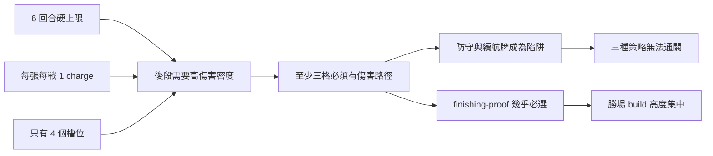

# Gate 2 可行性模擬報告

日期：2026-07-28  
Seed：`draft-only-autobattler-gate-2-baseline`  
每輪局數：20,000  
結論：**未通過，不得進入 Gameplay Engineering**

## 執行摘要

第二輪最終模型仍只有 11.43% 總勝率；assault 接近目標，但其餘三種策略幾乎無法完成 run。勝場集中在少數傷害組合，與規格承諾的「條件腳本多樣性」矛盾。

這份結果只能判斷紙上規則不可行，不能判斷遊戲是否好玩。

## 同 seed 迭代比較

| 指標 | Baseline | 修訂 1 | 修訂 2（最終） | 目標 |
|---|---:|---:|---:|---:|
| 總勝率 | 8.50% | 22.47% | 11.43% | 25–40% |
| assault | 33.96% | 89.75% | 39.03% | 策略差 ≤18pp |
| fortress | 0% | 0% | 6.03% | 策略差 ≤18pp |
| reactive | 0% | 0% | 0% | 策略差 ≤18pp |
| threshold | 0% | 0% | 0.63% | 策略差 ≤18pp |
| 最大勝場 build | 100% | 100% | 27.66% | ≤30% |
| 前五勝場 build | 100% | 100% | 82.32% | ≤45% |

### 勝率視覺化（最終輪）

```text
assault   39.03%  ████████████████████
fortress   6.03%  ███
reactive   0.00%
threshold  0.63%  ▎
overall   11.43%  ██████
```

## 修訂內容

### Baseline

- 玩家基礎傷害 2。
- 四格可全選防守。
- 效果簡化為固定 damage／heal／guard。

結果只有 assault 能贏，且所有勝場都是同一組四張。

### 修訂 1

- 基礎傷害由 2 調成 3。
- 理性選牌模型至少攜帶兩張傷害指令。

總勝率提高，但只是把 assault 推到 89.75%，其他策略仍為 0%。Boss 的傷害需求在數學上排除防守 build。

### 修訂 2

- 忠實實作 `amplify_base`、`guard_and_damage`、`damage_per_round`。
- 四格至少三張具傷害路徑。
- `measured-salvo` 補入 reactive 標籤，讓延遲引信可能在後續回合觸發。
- 低血進場會產生一次 `self_below_half` 事件。
- 每局加入由 seed 產生的卡牌偏好，避免同策略機械式固定一組牌。

Build 數量增加，但非 assault 策略仍幾乎不能通關；多樣性主要出現在敗場，不是有效選擇。

## 指令健康度（最終輪）

| 指令 | 勝場 loadout 出現率 | 判定 |
|---|---:|---|
| finishing-proof | 99.17% | 實質必選 |
| redline-clause | 79.52% | 過度集中 |
| measured-salvo | 65.65% | 偏高 |
| first-word | 60.09% | 偏高 |
| delayed-fuse | 41.88% | 可用 |
| breach-mark | 21.79% | 可用 |
| mercy-loop | 13.96% | 可用 |
| sealed-answer | 13.13% | 可用 |
| mirrored-debt | 4.29% | 邊緣 |
| reserve-spark | 0.39% | 廢物選項 |
| stone-protocol | 0.13% | 廢物選項 |
| harvest-logic | 0% | 廢物選項 |

## 根因



持久生命讓 heal／guard 看似有跨遭遇價值，但 6 回合傷害檢查先把低輸出 build 淘汰。這是規則結構衝突，不是單卡數值問題。

## 建議

Balance Engineer 不建議第三輪數值修補。若要保留專案，必須回到 Designer 做結構性 pivot，至少改變以下一項：

1. 指令不占用傷害經濟，例如每格同時含一個基礎動作與一個條件修飾。
2. 移除固定基礎攻擊，改成敵我公開事件的反應式「配對解謎」。
3. 將勝利條件從限時擊殺改為完成不同契約目標，讓防守腳本能真正獲勝。

以上都會重寫核心循環，不能視為小型平衡調整。

## Gate 2 建議

**建議停止本規格，不進入工程。**

如果 Studio Head 仍要保留「條件腳本」題目，應重新立案為新提案並回 Gate 1；若首要目標是盡快完成第一款作品，則回到已通過初篩的其他候選題目，避免在已失效的市場差異化上繼續投入。
