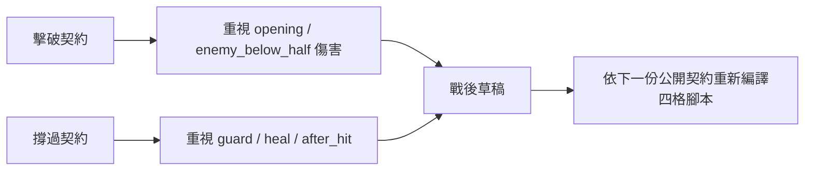

# Vertical Slice 正式 Core 平衡報告

日期：2026-07-28  
Seed：`draft-only-autobattler-live-core-v1`  
局數：20,000  
結論：**通過數學可試玩門檻，進 Gate 3；不宣稱已證明好玩**

## 結構修正

舊模型要求七場全部在六回合內擊殺，四個一次性槽位因此至少三格必須提供傷害，防守與反應 build 被數學排除。

正式 core 把遭遇改成公開的兩種契約：



七戰交替要求擊破與撐過，Boss 最後檢查玩家能否把整局收藏重編譯成擊破腳本。

## 同 seed 前後比較

| 指標 | 舊紙上模型 | 正式 core | 目標 | 結果 |
|---|---:|---:|---:|---|
| 總勝率 | 11.43% | 25.48% | 25–40% | 通過 |
| assault | 39.03% | 23.69% | — | — |
| fortress | 6.03% | 23.35% | — | — |
| adaptive | 0% | 24.41% | — | — |
| threshold | 0.63% | 30.50% | — | — |
| 四策略落差 | 39.03pp | 7.15pp | ≤18pp | 通過 |
| 平均完成遭遇 | — | 6.08 / 7 | — | — |
| 前五勝場 build | 82.32% | 44.14% | ≤45% | 通過 |

### 策略勝率

```text
assault   23.69%  ████████████
fortress  23.35%  ████████████
adaptive  24.41%  ████████████
threshold 30.50%  ███████████████
overall   25.48%  █████████████
```

## 指令健康度

這裡計算「一個勝利 run 是否曾在任一非固定遭遇裝備該指令」，而不是只看 Boss 最後四張。原因是不同公開契約本來就要求玩家換裝；只看 Boss 會把所有防守牌錯判為廢物。

| 指令 | 勝利 run 使用率 |
|---|---:|
| 先聲誓詞 | 100.00% |
| 破口標記 | 19.94% |
| 節制齊射 | 60.60% |
| 後備火種 | 59.42% |
| 石牆協議 | 100.00% |
| 鏡像債務 | 28.81% |
| 紅線條款 | 73.76% |
| 慈悲迴路 | 100.00% |
| 終局證明 | 100.00% |
| 收割邏輯 | 82.65% |
| 封印解答 | 100.00% |
| 延遲引信 | 36.24% |

沒有指令低於 2% 廢物門檻。100% 的五張包含四張固定起手，以及跨攻防皆有效的封印解答；Gate 3 應特別觀察它們是必要教學骨架還是實質必選。

## 決定性與測試

- `src/core/index.test.ts` 驗證同 seed、同 loadout 的完整 timeline 相同。
- `sim/live-core.test.ts` 驗證 100 局同 seed 批次結果完全相同。
- production core 不 import DOM 或渲染層，正式模擬直接呼叫它。

## 未被數學回答的問題

- 四格排序在真人眼中是否真的有理由，而不是照觸發時機機械排序。
- 一次提交後只能觀看 10–20 秒是否有足夠張力。
- 戰鬥追溯是否讓失敗可理解，還是資訊量過多。
- 每場在擊破／撐過間切換是否形成適應感，或只是明顯換成全攻／全守。

這四題只能由 Gate 3 人類試玩判斷。
